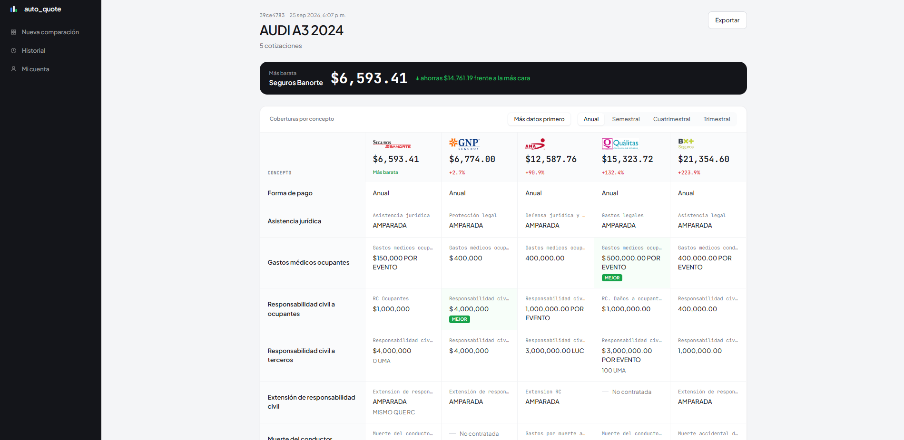
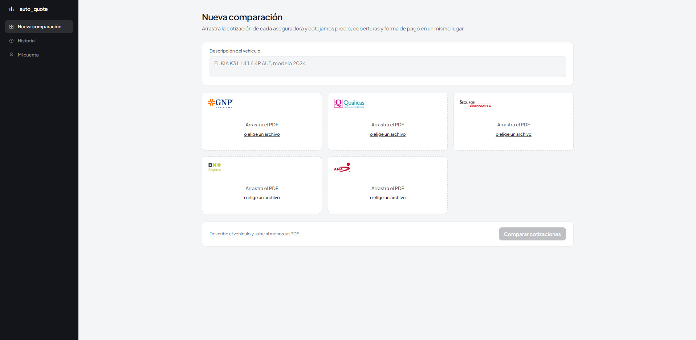

<h1 align="center">Hi, I'm Rafael Madera 👋</h1>

  Software Developer · Mérida, Yucatán, Mexico

  
  

---

## About Me

- 🎓 Final-year Software Engineering student at the **School of Mathematics, Universidad Autónoma de Yucatán (UADY)**, graduating in **December 2026**
- 🌐 Full-stack web development with **TypeScript, React, NestJS and FastAPI**
- ☁️ Into **DevOps and cloud**: Docker, CI/CD, AWS and Google Cloud
- 🤖 Currently exploring **AI agents**, context engineering and spec-driven development

## Tech Stack

  

## Featured Project

### 🚗 Auto Quote — AI-powered car insurance quote comparison

A multi-tenant SaaS that reads car insurance quotes in PDF format from **GNP, Quálitas, Banorte, BX+ and ANA**, normalizes them and compares them side by side.

- 🤖 Extraction with **Google Gemini**, working on both native PDFs and scanned documents or photos (multimodal vision)
- ⚡ Global **SHA-256** content-hash cache: a PDF that was already processed costs zero AI tokens
- 🧮 Accounting validation of every quote (net premium + surcharges + fees + VAT = total) with a confidence score
- 🏢 Offices with subscription plans, shared monthly quotas, JWT auth and full data isolation between tenants
- 🔒 Rate limiting, and PDF parsing in sandboxed child processes with timeouts and memory caps
- 📡 Live progress over NDJSON streaming, plus PDF export from the UI

`Python` `FastAPI` `PostgreSQL` `SQLAlchemy` `Alembic` `React 19` `TypeScript` `Docker` `GitHub Actions` `Cloud Run`

  

More screenshots

 

  

> *Private repository — source code available on request.*

### Other Projects

| Project | Description | Stack |
|---|---|---|
| [CCEI-MAP](https://github.com/RafaMadera18/CCEI-MAP) | Campus app showing classroom locations, schedules and academic events at UADY's Exact Sciences and Engineering campus | — |
| [CS_Equipo4](https://github.com/RafaMadera18/CS_Equipo4) | Hotel management software for the "María de Guadalupe" hotel | TypeScript |
| [DevOps_ProyectoFinal](https://github.com/RafaMadera18/DevOps_ProyectoFinal) | Vehicle fleet management system built with a continuous integration pipeline | DevOps · CI/CD |
| [AWS_ProyectoFinal](https://github.com/RafaMadera18/AWS_ProyectoFinal) | REST API deployed on AWS | NestJS · AWS |
| [devtree](https://github.com/RafaMadera18/devtree) | "Link in bio" platform for developers | TypeScript · React |

## GitHub Stats

  <picture>
    <source media="(prefers-color-scheme: dark)" srcset="https://github-readme-stats.vercel.app/api?username=RafaMadera18&show_icons=true&hide_border=true&theme=dark&bg_color=0d1117" />
    
  </picture>
  <picture>
    <source media="(prefers-color-scheme: dark)" srcset="https://github-readme-stats.vercel.app/api/top-langs/?username=RafaMadera18&layout=compact&hide_border=true&theme=dark&bg_color=0d1117" />
    
  </picture>

  <picture>
    <source media="(prefers-color-scheme: dark)" srcset="https://streak-stats.demolab.com?user=RafaMadera18&hide_border=true&theme=dark&background=0d1117" />
    
  </picture>

